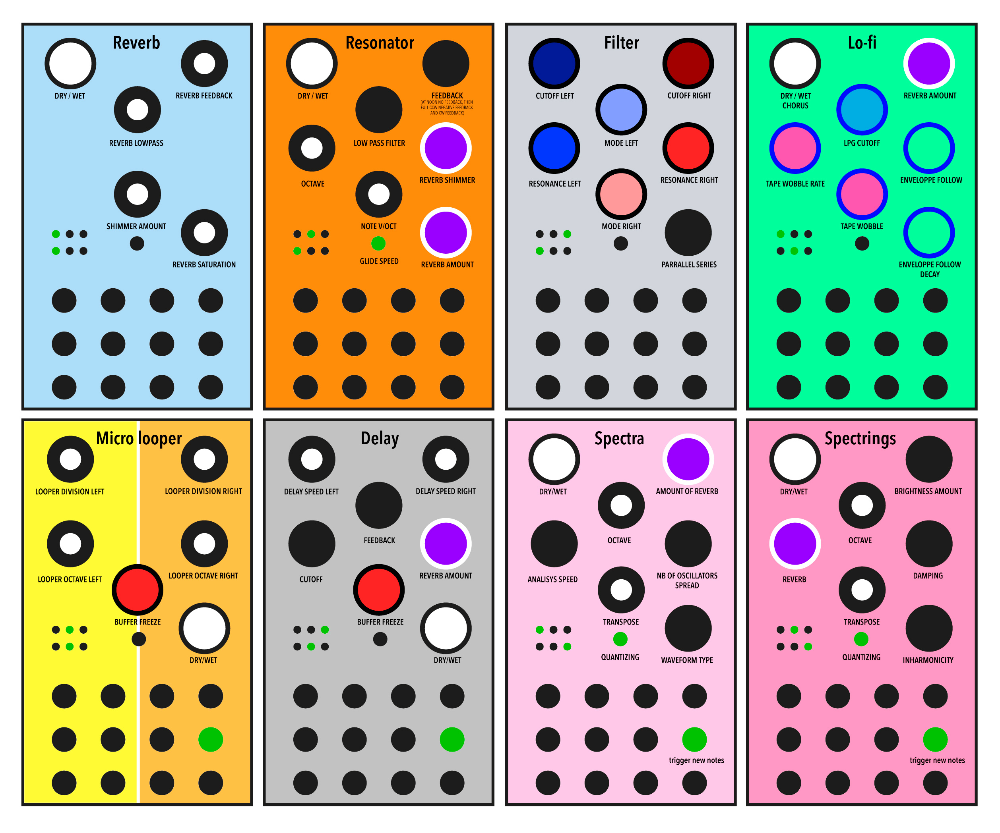

# MultiVersio

MultiVersio is a custom firmware for Noise Engineering's Versio Eurorack module platform
that allows any Noise Engineering Versio model to assume various roles while playing live
just by using the front panel switches.

[Paolo Ingraito](https://github.com/fluffyaudio) is the author.

## Discussion

More information and discussion at [Modwiggler](https://www.modwiggler.com/forum/viewtopic.php?t=249058)

### Modes

Use the two positional switches on your Versio's front panel to change modes, as pictured below:



Diagram thanks to Tinmaar159 on Modwiggler

**Reverb** A reverb with infinite feedback and shimmer.
* An envelope follower tames the feedback by preventing clipping.

**Resonator** Tuned Karplus-Strong resonator with reverb, inspired by Mimeophon's KS mode.
* Audio input is fed into resonator and then controllable one pole low pass filter.
* Note input tracks 1V/Oct, and the feedback is restrained with an envelope follower as in Reverb mode.
* Note glide is controllable with the panel's button.
* Reverb option, with feedback, shimmer, and envelope follower taming infinite feedback as in above mode.

**Filter** Dual multimode stereo filter based on the Mutable Instruments Blades. Provides low pass, band pass, high pass.
* Left and Right cutoff, mode, resonance independently controllable. Can behave as a stereo filter or two mono filters. 
* Lower-right knob controls routing, smoothly changing clockwise from parallel to series

**Lo-Fi** Tape-like effect ranging from subtle, saturated tape wobble to brittle, fragile sound from almost any
input source. Inspired by the Shallow Water pedal.
* Optional reverb and Chorus
* Low Pass Gate with knob-controllable cutoff frequency
* Knob-controllable envelope follower modulation of Low Pass Gate
* Tape delay effect with wobble rate and depth
* If LPG cutoff is fully CCW, subtle high Pass filter and saturation added

**Micro Looper** A clockable dual glitch looper with knob-controllable play speed and repetitions. Panel is divided
into independently looped left and right halves. Like Qu-Bit Data Bender, this mode shines with modulation!
* Clock input is required, fourth input jack on row 2
* Buffer freeze via knob

**Delay** A clockable dual/stereo delay with independently controllable channels. Sound is similar to
the Mimeophon. Unlike many delays, can tolerate clock changes without pitching the audio.
* Clock input at fourth input jack on row 2
* Feedback can be tamed with user-controllable filter cutoff
* Optional reverb
* Buffer freeze option via knob

**Spectra** Spectral resynthesis of input audio. When a trigger is received, up to six
active oscillators tune to harmonics of input audio.
* Resynthesis of incoming audio is triggered at falling edge of trigger/gate input
at fourth input jack on row 2
* Pitch controllable at second input jack on row 2
* Optional reverb

Sounds beautiful with a multiple or division of clock as trigger.

Try *demonizing* speech as the audio input by sending a fast trigger in with Analysis Speed knob turned
clockwise

**Spectrings** Similar to Spectra, but uses two string voices from Mutable Instruments Rings/Plaits.
* Resynthesis of incoming audio is triggered at falling edge of trigger/gate input
  at fourth input jack on row 2.
* Optional reverb

## Acknowledgements

Thanks to Emilie Gilliet (spectrings and many filters are derived from her wonderful work).
Thanks to the Daisy developers at Electrosmith for their lovely platform. And thanks to Noise Engineering for their awesome products!

## Install

1. Download pre-built firmware from the releases page.
2. Log into the Versio [customer portal](https://portal.noiseengineering.us/) using your Noise Engineering customer account.
3. Go to the Firmware page of the customer portal.
4. Connect your Versio module to your computer, and press buttons on the back to prepare your Versio module to receive firmware by following Noise Engineering's instructions on the Firmware page.
5. Choose 'Custom Firmware' from the drop-down, choose the .bin file and wait for completion.
6. Power Cycle your Versio and enjoy

## Build

To build this firmware on your own machine, ensure you have base developer tools prerequisites such as git and make installed.

### Getting latest source

To get the latest firmware source code to your machine:

```console
> git clone --recursive https://github.com/fluffyaudio/MultiVersio
> cd MultiVersio
```

If you have already cloned the directory but want to update it to the latest source code in the repository:

```console
> cd MultiVersio
> git pull --recurse-submodules  # also updates Daisy platform and other deps
```

### Tool prerequisites

1. Install Electrosmith's [Daisy toolchain](https://github.com/electro-smith/DaisyToolchain) according to instructions.

### Compiling

Build using Visual Studio / VSCode using .sln files or by running `make` on non-Windows platforms.

If compilation is successful, load `build/MultiVersio.bin` using the Versio web installer.

### Debug

Debugging via breakpoints or even logging requires the ST Link V3 MiniE board, available
at [Electrosmith](https://www.electro-smith.com/daisy/stlink-v3mini) and elsewhere.

## Contributing / Hacking

This easy to build, very readable project is a fun way to get started playing with custom firmware on the Versio platform.

Feel free to update and improve the code! Please share your contributions so we can improve on this little thing :)
